# AWS Todo App Deployment Project

A comprehensive infrastructure-as-code project demonstrating the deployment of a full-stack Todo web application on AWS using two distinct environments: Development (EC2-based) and Production (ECS-based). This project serves as a reference implementation showcasing AWS best practices, containerization, CI/CD pipelines, and scalable architecture patterns.

## Table of Contents

- [I. Overview](#i-overview)
  - [1. Project Summary](#1-project-summary)
  - [Source Code Repositories](#source-code-repositories)
  - [2. Architecture](#2-architecture)
  - [3. Deployment Plans](#3-deployment-plans)
  - [4. Tech Stack](#4-tech-stack)
- [II. Prepare](#ii-prepare)
  - [1. GitHub Setup](#1-github-setup)
  - [2. AWS CLI](#2-aws-cli)
  - [3. Domain](#3-domain)
  - [4. S3 Backend](#4-s3-backend)
- [III. Dev Environment](#iii-dev-environment)
  - [1. Network](#1-network)
  - [2. ACM](#2-acm)
  - [3. Parameter Store](#3-parameter-store)
  - [4. ALB](#4-alb)
  - [5. EC2 Instance ](#5-ec2-instance)
  - [6. CI/CD](#6-cicd)
- [IV. Prod Environment](#iv-prod-environment)
  - [1. Network](#1-network-1)
  - [2. Dependencies](#2-dependencies)
  - [3. Application](#3-application)
  - [4. CI/CD](#4-cicd-1)

---

## I. Overview

### 1. Project Summary

This project demonstrates enterprise-grade cloud infrastructure deployment for a Todo web application on AWS. It includes two deployment strategies:

**Development Environment**: A flexible setup using EC2 instances with optional Auto Scaling Group for high availability. Supports both single-instance (cost-effective) and multi-AZ deployment with Docker containerization, suitable for testing and development workflows.

**Production Environment**: A highly available, scalable architecture leveraging ECS (Elastic Container Service), RDS, CloudFront, and automated CI/CD pipelines for production workloads.

**Key Features**:
- Multi-environment deployment (Dev/Prod)
- Infrastructure as Code using Terraform
- Containerized applications with Docker
- Automated CI/CD pipelines
- SSL/TLS certificates via ACM
- Monitoring with CloudWatch
- Secure secret management

**Purpose**: This is a reference implementation for educational and demonstration purposes, showcasing modern DevOps practices and AWS service integration.

### Source Code Repositories

Access the complete source code for this project:

| Repository | Description | Technology Stack | URL |
|------------|-------------|------------------|-----|
| **Frontend** | Todo application frontend with modern UI | Next.js, TypeScript, React | [todo_app-fe](https://github.com/Jayce-Anh/todo_app-fe.git) |
| **Backend** | RESTful API backend with authentication | Laravel, PHP, MySQL | [todo_app-be](https://github.com/Jayce-Anh/todo_app-be.git) |
| **Infrastructure** | Infrastructure as Code (IaC) for AWS deployment | Terraform, AWS | [todo_app-infra](https://github.com/Jayce-Anh/todo_app-infra.git) |

**Quick Clone Commands**:

```bash
# Clone all repositories
git clone https://github.com/Jayce-Anh/todo_app-fe.git
git clone https://github.com/Jayce-Anh/todo_app-be.git
git clone https://github.com/Jayce-Anh/todo_app-infra.git
```

### 2. Architecture

**Development Environment**:

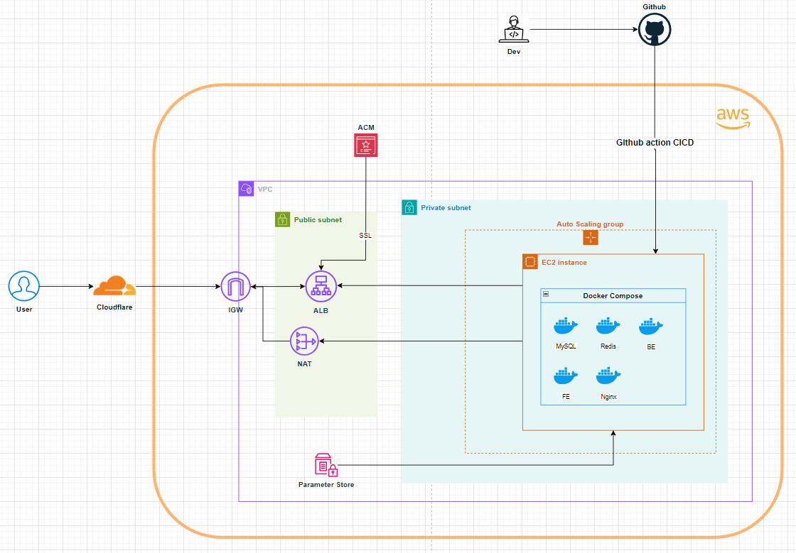

**Production Environment**:

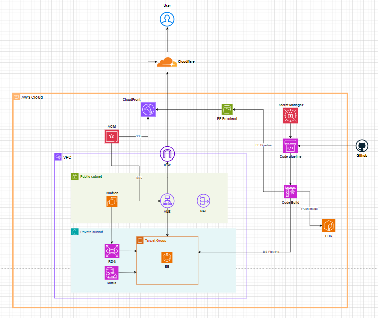

### 3. Deployment Plans

**Development Environment**:

1. **Prepare**: Configure AWS credentials, GitHub tokens, and domain settings
2. **Deploy Infrastructure**: Use Terraform to provision VPC, subnets, security groups, and EC2 instances
3. **Application Setup**: Install Docker on EC2 instance and deploy frontend, backend, database, and Nginx using Docker Compose
4. **CI/CD Configuration**: Set up GitHub Actions with self-hosted runners

**Production Environment**:

1. **Prepare**: Configure AWS credentials, GitHub tokens, and domain settings
2. **Deploy Infrastructure**: Deploy Terraform modules in order:
   - Network (VPC, subnets, NAT gateways)
   - Dependencies (ACM, ECR, Secret Manager, RDS, Redis)
   - Application (ECS, ALB, CloudFront, S3)
   - CI/CD (CodePipeline, CodeBuild)
3. **Configuration**: Set up RDS, ECS services, secrets, and DNS records
4. **CI/CD Setup**: Configure AWS CodePipeline for automated deployments

### 4. Tech Stack

**Development Environment**:
- **Compute**: EC2 with Auto Scaling Group (multi-AZ support) or single instance
- **Services**: Frontend, Backend, MySQL, Redis, Nginx (Docker containers)
- **Load Balancing**: Application Load Balancer with health checks
- **High Availability**: Multi-AZ deployment with automatic failover
- **Auto Scaling**: CPU-based scaling (scales between 2-3 instances)
- **Secrets**: AWS Parameter Store
- **CI/CD**: GitHub Actions with self-hosted runners
- **Monitoring**: CloudWatch with custom metrics

**Production Environment**:
- **Frontend**: S3 + CloudFront CDN
- **Backend**: ECS (Elastic Container Service)
- **Database**: Amazon RDS (MySQL)
- **Cache**: Amazon ElastiCache (Redis)
- **Secrets**: AWS Secrets Manager
- **CI/CD**: AWS CodePipeline + CodeBuild
- **Monitoring**: CloudWatch with custom dashboards and alarms

## II. Prepare

### 1. GitHub Setup

**Generate GitHub Token for AWS CodePipeline**:
- Navigate to GitHub Settings → Developer Settings → Personal Access Tokens
- Create a new token with appropriate permissions

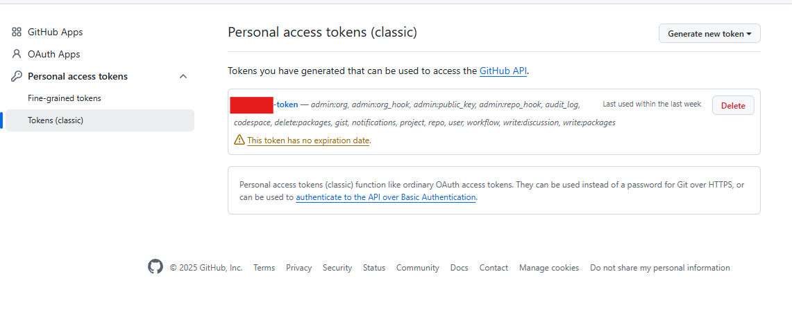

**Configure SSH Keys**:
- Generate SSH keys on your local machine, server, or bastion host
- Add the public key to your GitHub account


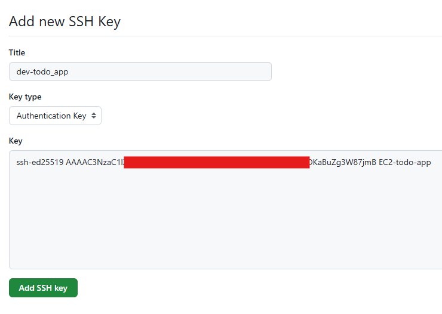

### 2. AWS CLI

**Create Access Keys**:
- Create AWS CLI access keys for Terraform in both Dev and Prod accounts
- Store credentials securely


**Configure AWS Profiles**:
- Set up AWS profiles and credentials for both environments

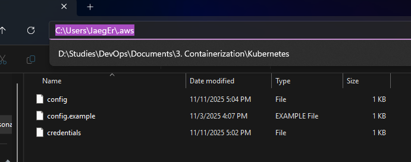

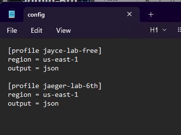

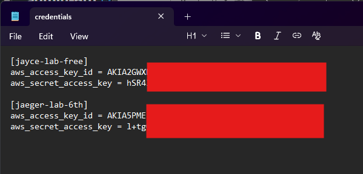

### 3. Domain

**Domain Registration**:
- Prepare your domain (e.g., `jayce-lab.work`)
- Configure DNS settings

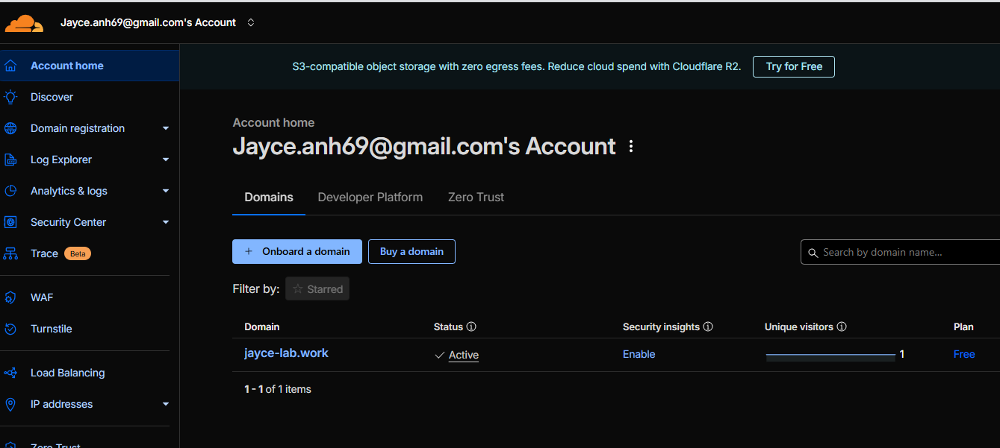

### 4. S3 Backend

**Create S3 Buckets for Terraform State**:
- Create S3 buckets in both Dev and Prod accounts to store Terraform state

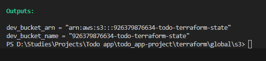

**Verification**:

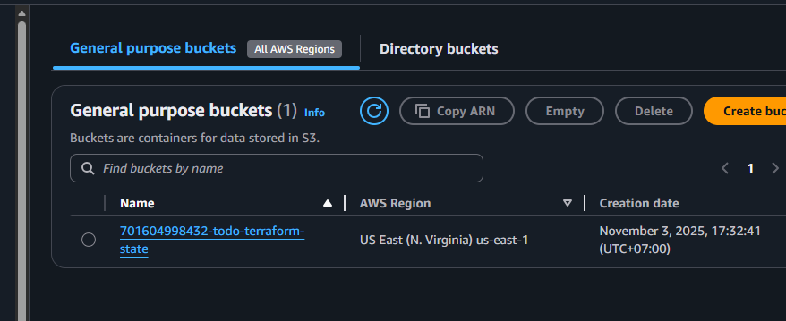

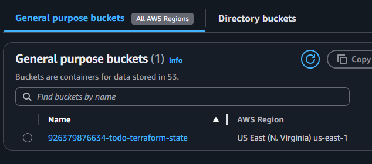

## III. Dev Environment

Before starting, ensure you have cloned the infrastructure repository:

```bash
git clone https://github.com/Jayce-Anh/todo_app-infra.git
cd todo_app-infra/envs/dev
```

### 1. Network

**Deploy VPC Module**:

```bash
terraform apply --target=module.vpc
```

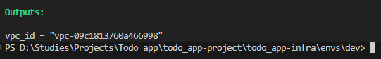

**Verify Configuration**:

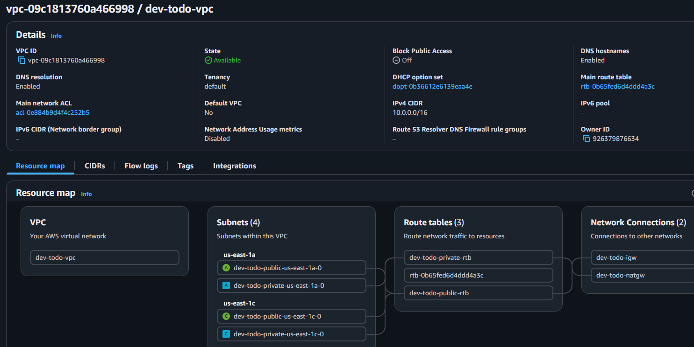

### 2. ACM

**Deploy ACM Module**:

```bash
terraform apply --target=module.acm
```

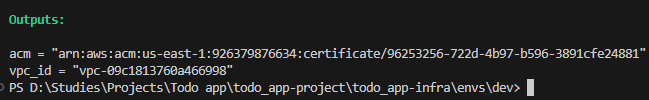

**Add CNAME Records**:
- Add the validation CNAME records to your domain management system

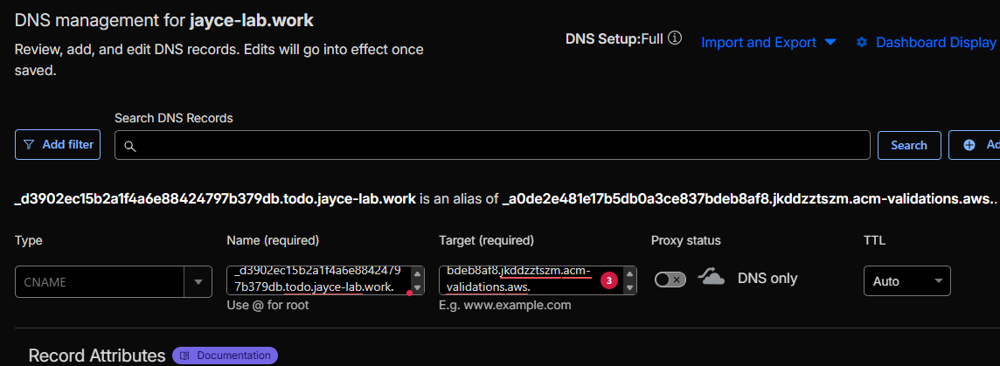

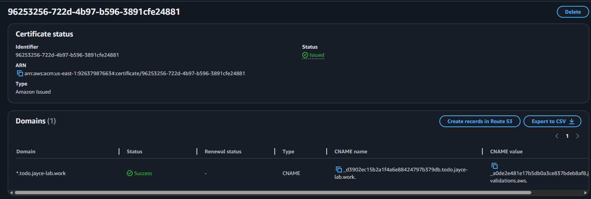

### 3. Parameter Store

**Deploy Parameter Store Module**:

```bash
terraform apply --target=module.parameter_store
```

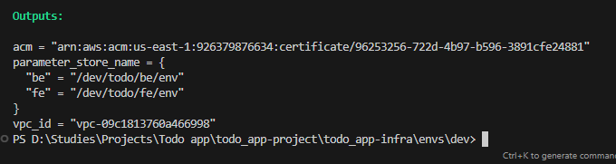

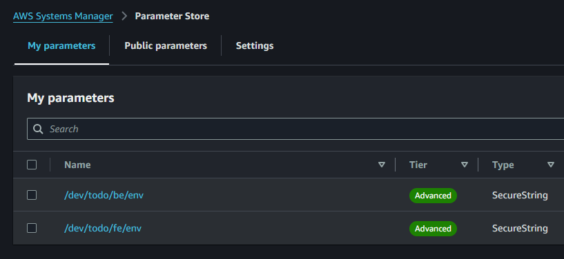

**Add Environment Secrets**:
- Upload your environment variables and secrets to Parameter Store

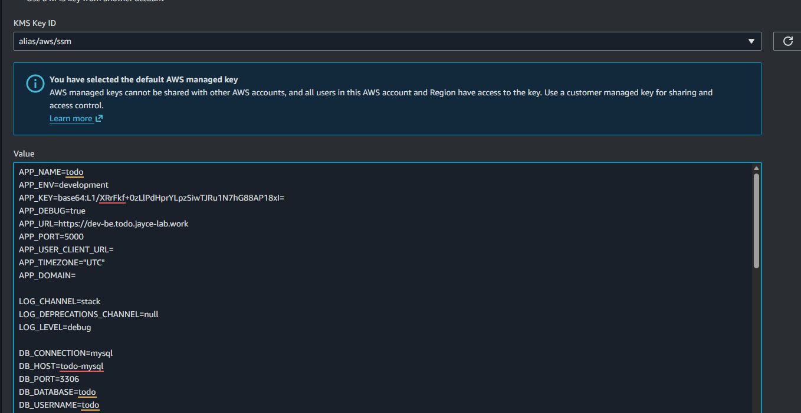

### 4. ALB

**Deploy ALB Module**:

```bash
terraform apply --target=module.alb
```

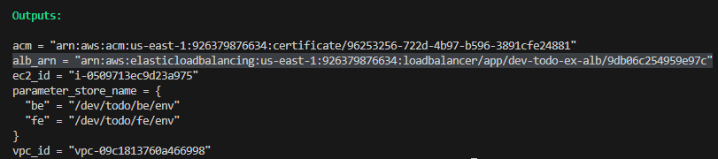

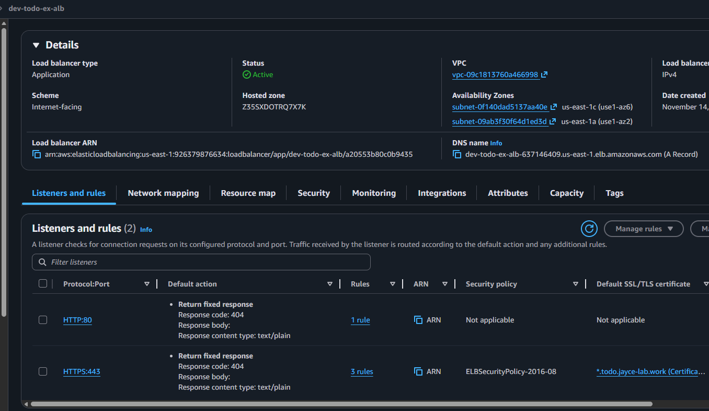

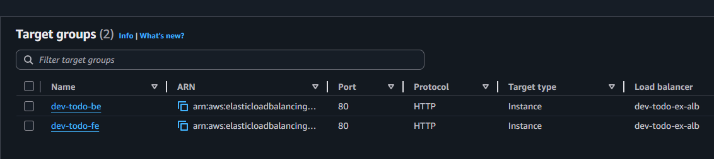

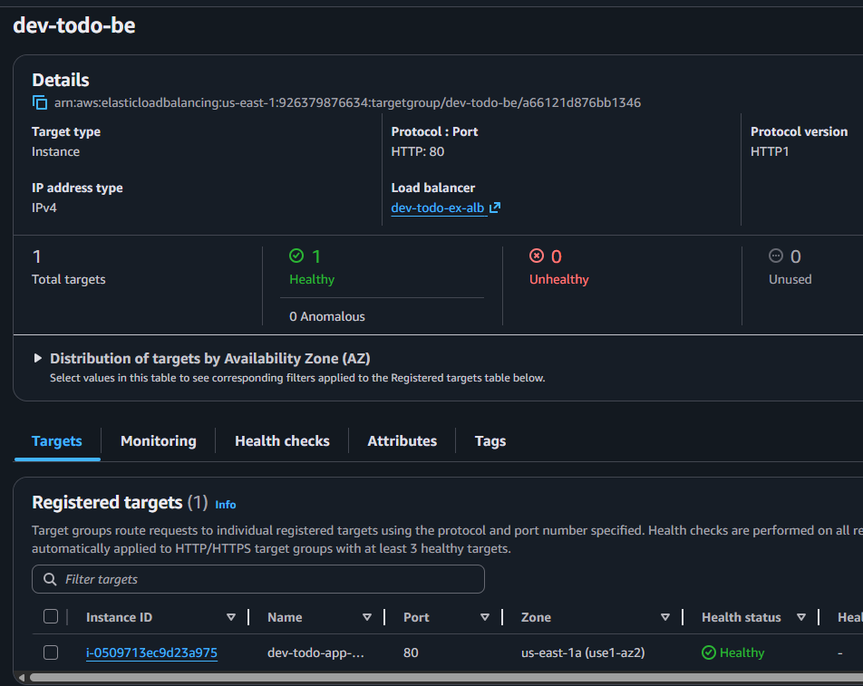

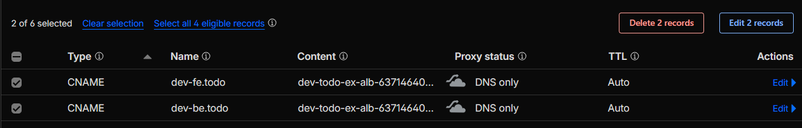

### 5. EC2 Instance 

**Deploy EC2 Instance Module with High Availability**:

The EC2 module supports two deployment modes:

1. **Single Instance Mode** (Cost-effective):
   - Set `enable_asg = false`
   - Deploys one EC2 instance in a single subnet
   - Suitable for development/testing

2. **Auto Scaling Group Mode** (High Availability):
   - Set `enable_asg = true`
   - Deploys instances across multiple AZs
   - Automatic failover and scaling

**Configuration for Multi-AZ with Auto Scaling**:

```hcl
module "ec2_instance" {
  source = "../../modules/ec2"
  
  # Enable Auto Scaling Group for HA
  enable_asg       = true
  subnet_ids       = module.vpc.public_subnet_ids  # Multi-AZ
  desired_capacity = 2    # 2 instances (one per AZ)
  min_size         = 2    # Minimum for HA
  max_size         = 4    # Maximum during high load
  
  # Health checks via ALB
  health_check_type         = "ELB"
  health_check_grace_period = 300
  
  # ALB integration
  target_group_arns = [
    module.alb.tg_arns["be"],
    module.alb.tg_arns["fe"]
  ]
  
  # Auto Scaling Policy
  enable_cpu_scaling = true
  cpu_target_value   = 90  # Scale when CPU > 90%
}
```

**Deploy the infrastructure**:

```bash
terraform apply --target=module.ec2_instance
```

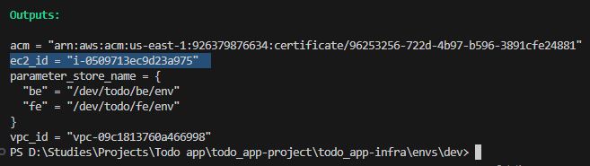

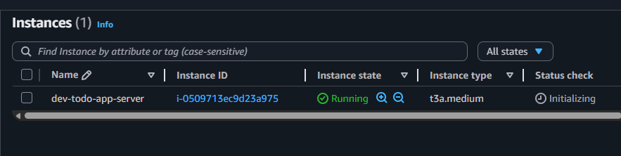

**High Availability Features**:

| Feature | Description |
|---------|-------------|
| **Multi-AZ Deployment** | Instances distributed across 2+ availability zones |
| **Automatic Failover** | If one AZ fails, traffic routes to healthy instances in other AZs |
| **Health Checks** | ALB monitors instance health and removes unhealthy instances |
| **Auto Scaling** | Automatically adds instances when CPU > 90% |
| **Self-Healing** | Failed instances are automatically replaced |
| **Load Distribution** | Traffic is evenly distributed across all healthy instances |

**Scaling Behavior**:

```
Normal Load (CPU < 90%):     High Load (CPU > 90%):
┌─────────────────────┐      ┌─────────────────────┐
│ AZ-A: Instance 1    │      │ AZ-A: Instance 1    │
│ AZ-B: Instance 2    │      │ AZ-A: Instance 2    │
└─────────────────────┘      │ AZ-B: Instance 3    │
                             │ AZ-B: Instance 4    │
                             └─────────────────────┘
```

**Memory and Disk Monitoring**:

For advanced scaling based on memory or disk usage, install CloudWatch Agent in your user data script:

```bash
#!/bin/bash
# Install CloudWatch Agent
wget https://s3.amazonaws.com/amazoncloudwatch-agent/ubuntu/amd64/latest/amazon-cloudwatch-agent.deb
dpkg -i amazon-cloudwatch-agent.deb

# Configure to send memory and disk metrics
cat > /opt/aws/amazon-cloudwatch-agent/etc/config.json <<EOF
{
  "metrics": {
    "namespace": "CustomApp",
    "metrics_collected": {
      "mem": {
        "measurement": [{"name": "mem_used_percent"}]
      },
      "disk": {
        "measurement": [{"name": "disk_used_percent"}],
        "resources": ["*"]
      }
    }
  }
}
EOF

# Start the agent
/opt/aws/amazon-cloudwatch-agent/bin/amazon-cloudwatch-agent-ctl \
  -a fetch-config -m ec2 -s -c file:/opt/aws/amazon-cloudwatch-agent/etc/config.json
```

**Clone Source Code**:

SSH into the EC2 instance and clone the application repositories:

```bash
# SSH to EC2 instance
ssh -i your-key.pem ubuntu@<ec2-public-ip>

# Create project directory
mkdir -p ~/project && cd ~/project

# Clone frontend repository
git clone https://github.com/Jayce-Anh/todo_app-fe.git
cd todo_app-fe

# Clone backend repository
git clone https://github.com/Jayce-Anh/todo_app-be.git
cd todo_app-be
```

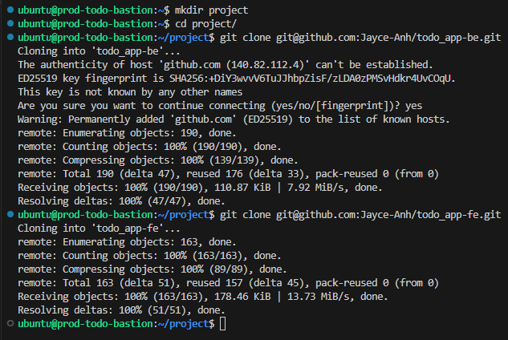

**Configure Docker Compose**:
- Create `docker-compose.yml` file
- Update environment variables for database and Redis connection settings

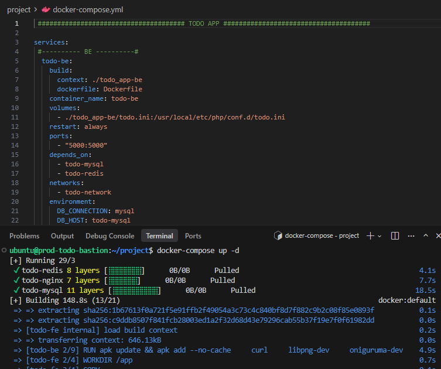

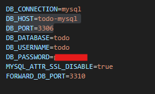

**Start Services**:

```bash
docker-compose up -d
```

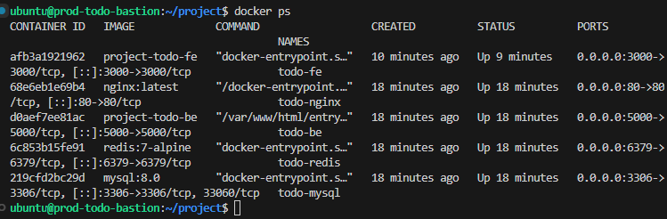

**Verify Services**:

```bash
# Check HTTP status codes
curl -s -o /dev/null -w "Frontend: %{http_code}\n" http://localhost:3000
curl -s -o /dev/null -w "Backend: %{http_code}\n" http://localhost:5000
curl -s -o /dev/null -w "Nginx: %{http_code}\n" http://localhost:80

# Check database and cache
docker exec todo-mysql mysqladmin -utodo -p${password} ping 2>/dev/null && echo "MySQL: OK"
docker exec todo-redis redis-cli ping
```

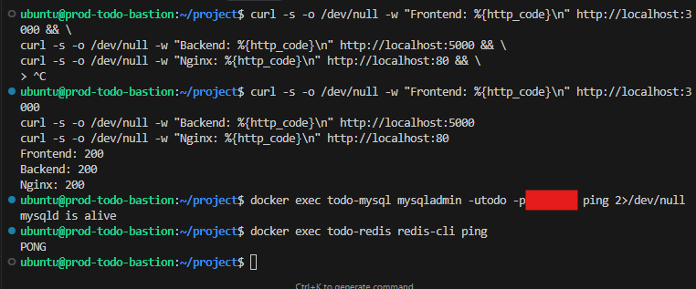

**Browser Verification**:

Backend API:

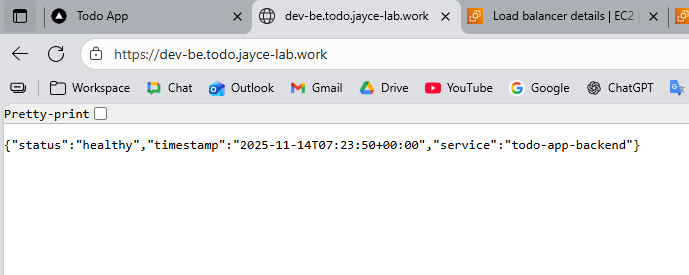

Frontend Application:

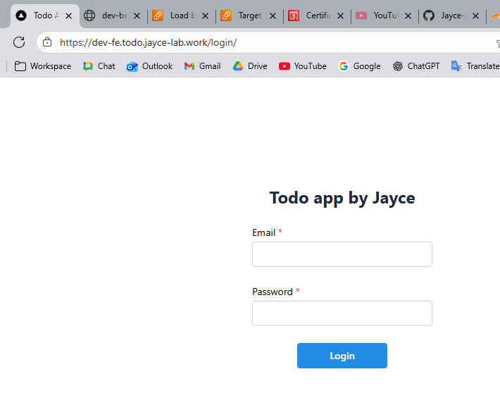

### 6. CI/CD

**Configure Self-Hosted Runners**:

1. Navigate to GitHub repository settings → Actions → Runners → Add new self-hosted runner

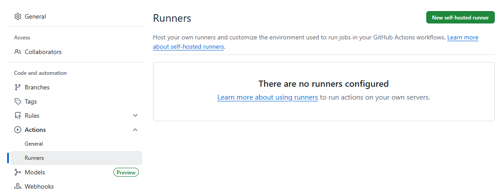

2. Select runner image and copy the download package URL

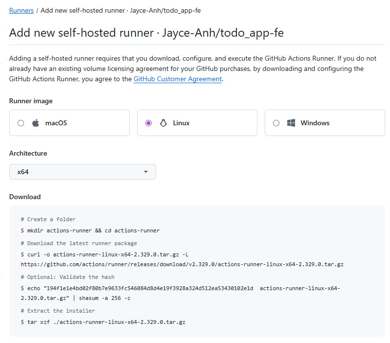

3. Create runner directories on EC2 instance for both frontend and backend

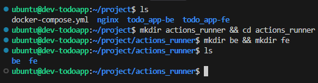

4. Download and extract the runner package in each directory:

```bash
curl -o actions-runner-linux-x64-2.329.0.tar.gz -L \
https://github.com/actions/runner/releases/download/v2.329.0/actions-runner-linux-x64-2.329.0.tar.gz

tar xzf ./actions-runner-linux-x64-2.329.0.tar.gz
rm actions-runner-linux-x64-2.329.0.tar.gz
```

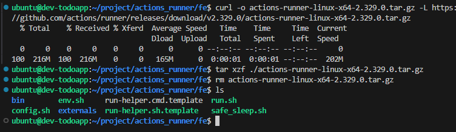

5. Configure the runner:

```bash
./config.sh --url https://github.com/<organization>/<repo> --token <YOUR_TOKEN>
```

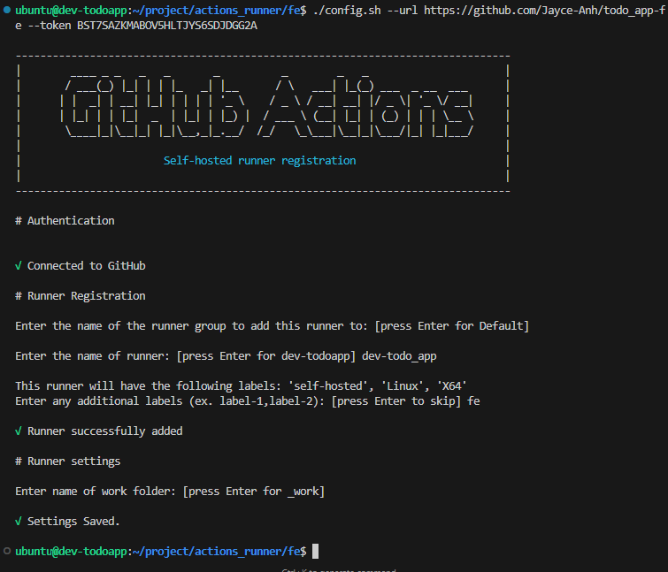

6. Install and start the runner as a service:

```bash
sudo ./svc.sh install
sudo ./svc.sh start
sudo ./svc.sh status

# Enable service on system restart
sudo systemctl enable actions.runner.<organization>-<repo-name>.<runner-name>.service
```

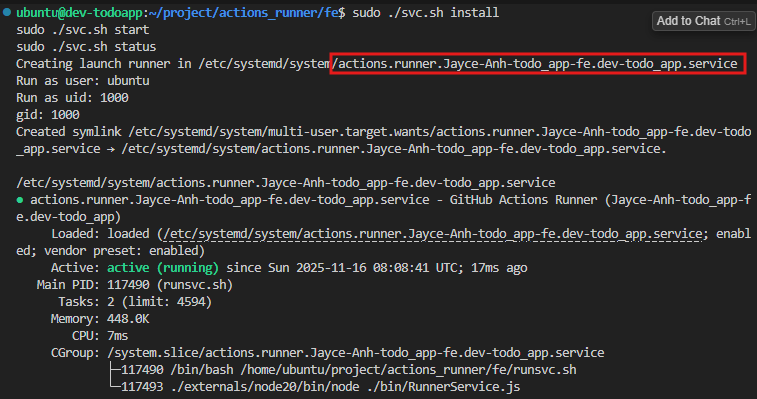

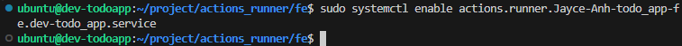

**Verify Runner Installation**:
- Check GitHub repository → Settings → Actions → Runners

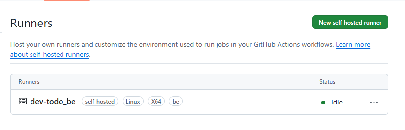

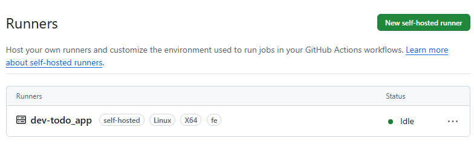

**Create GitHub Actions Workflows**:
- Create workflow files for both frontend and backend
- Save them to `.github/workflows/` directory in each repository

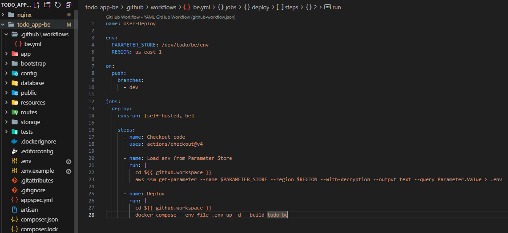

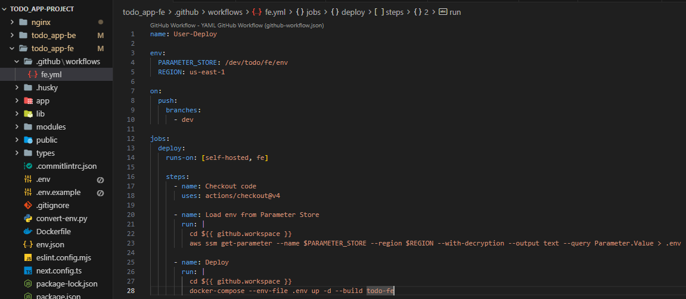

**Test Deployment Pipeline**:
- Commit and push changes to the repository

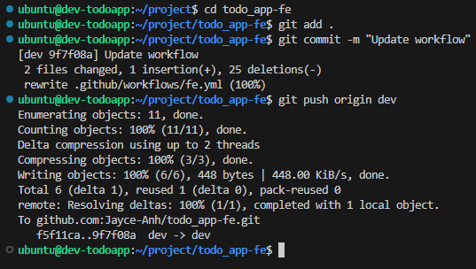

- Verify workflow execution in GitHub Actions

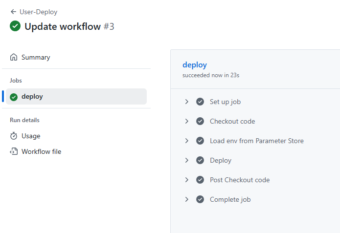

## IV. Prod Environment

Before starting, ensure you have cloned the infrastructure repository:

```bash
git clone https://github.com/Jayce-Anh/todo_app-infra.git
cd todo_app-infra/envs/prod
```

### 1. Network

**Deploy Network Module**:

```bash
cd 1-network
terraform init
terraform apply
```

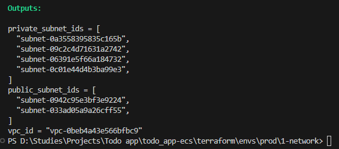

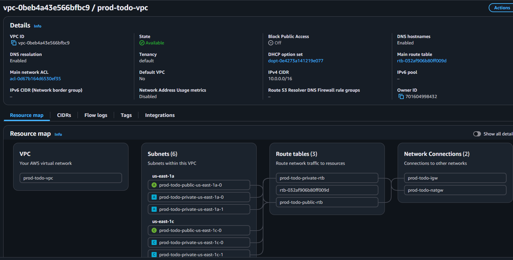

### 2. Dependencies

**Deploy Dependencies Module**:

```bash
cd 2-dependencies
terraform init
terraform apply
```

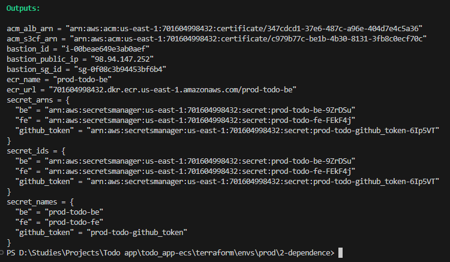

**ACM (AWS Certificate Manager)**:

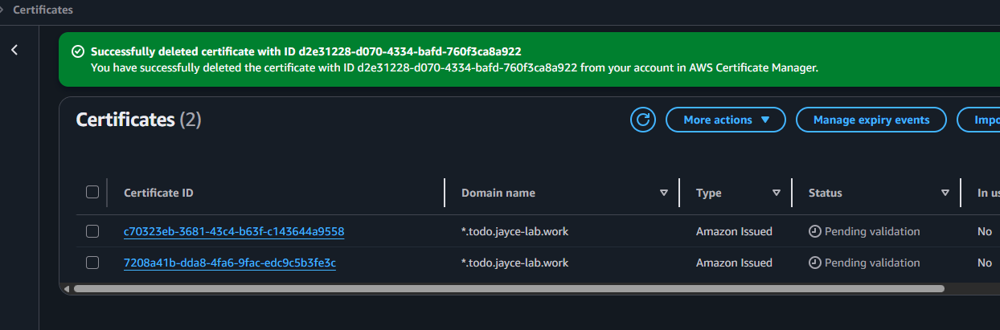


**ECR (Elastic Container Registry)**:

Build and push Docker images to ECR:


**Secrets Manager**:


1. Add GitHub token for CodePipeline:


2. Convert environment variables to JSON format:


```bash
python convert-env.py
```


3. Upload environment secrets to Secrets Manager:

```bash
# Backend secrets
aws secretsmanager put-secret-value \
  --secret-id prod-todo-be \
--secret-string file://env.json

# Frontend secrets
aws secretsmanager put-secret-value \
  --secret-id prod-todo-fe \
--secret-string file://env.json
```


> **Note**: Database and Redis host variables can be left blank initially and updated after RDS and Redis deployment.


**Verification**:


### 3. Application

**Deploy Application Module**:

```bash
cd 3-application
terraform init
terraform apply
```


**CloudFront Configuration**:

1. Add CNAME record for CloudFront distribution:


2. Build and extract frontend assets from Docker image:

```bash
cd ~/project/todo_app-fe

# Run container in background, copy assets, then clean up
docker run -d --name temp-build prod-todo-fe tail -f /dev/null
docker cp temp-build:/app/dist ./dist
docker stop temp-build
docker rm temp-build

# Verify build output
ls -la dist/
```


3. Sync frontend assets to S3 bucket:

```bash
aws s3 sync dist/ s3://prod-todo-fe-s3cf --delete --exact-timestamps
```


4. Verify frontend deployment in browser:


**Database Configuration**:

1. Copy RDS endpoint and Redis ARN, then update Backend Secrets Manager:


2. Test database connection from bastion host:


**ECS Service**:

Verify ECS service and container status:


**Application Load Balancer**:

1. Add CNAME record for ALB in domain management:


2. Verify backend API endpoint in browser:


**CloudWatch Monitoring**:

Verify CloudWatch dashboards and alarms:


### 4. CI/CD

**Deploy CI/CD Module**:

```bash
cd 4-cicd
terraform init
terraform apply
```


**Verify CodePipeline**:


---

## Summary

You have successfully deployed a full-stack Todo application on AWS with both Development and Production environments. The infrastructure demonstrates:

- **Multi-environment architecture** (Dev: EC2 with ASG, Prod: ECS-based)
- **High availability** at both Dev and Prod levels
  - Dev: Multi-AZ Auto Scaling Group with ALB
  - Prod: ECS with ALB, RDS Multi-AZ, and ElastiCache
- **Auto Scaling capabilities**
  - Dev: CPU-based auto-scaling (2-4 instances)
  - Prod: ECS service auto-scaling
- **Infrastructure as Code** with Terraform
- **Containerized deployments** with Docker
- **Automated CI/CD** pipelines (GitHub Actions for Dev, CodePipeline for Prod)
- **Secure secret management** (Parameter Store for Dev, Secrets Manager for Prod)
- **Monitoring and observability** with CloudWatch
- **Automatic failover** and self-healing infrastructure

### Key Features by Environment

**Development Environment**:
- ✅ Multi-AZ deployment with Auto Scaling Group
- ✅ Application Load Balancer with health checks
- ✅ Automatic failover between availability zones
- ✅ CPU-based auto-scaling (90% threshold)
- ✅ Self-healing: failed instances automatically replaced
- ✅ Cost-effective: scales down during low traffic

**Production Environment**:
- ✅ ECS with Fargate for serverless containers
- ✅ Multi-AZ RDS with automated backups
- ✅ CloudFront CDN for global content delivery
- ✅ ElastiCache for high-performance caching
- ✅ Advanced monitoring with custom CloudWatch dashboards

This project serves as a comprehensive reference for deploying modern, scalable, and highly available web applications on AWS following DevOps best practices.
